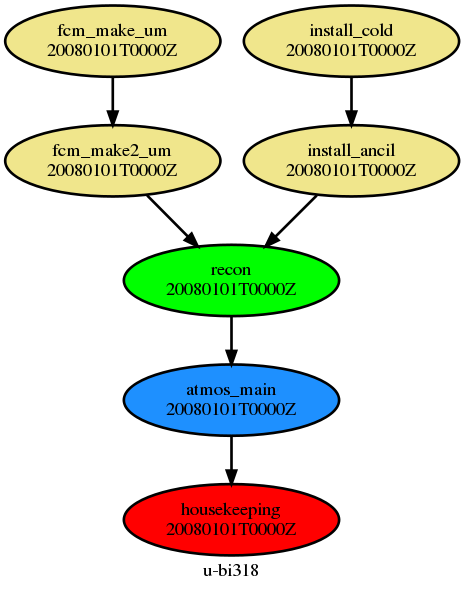
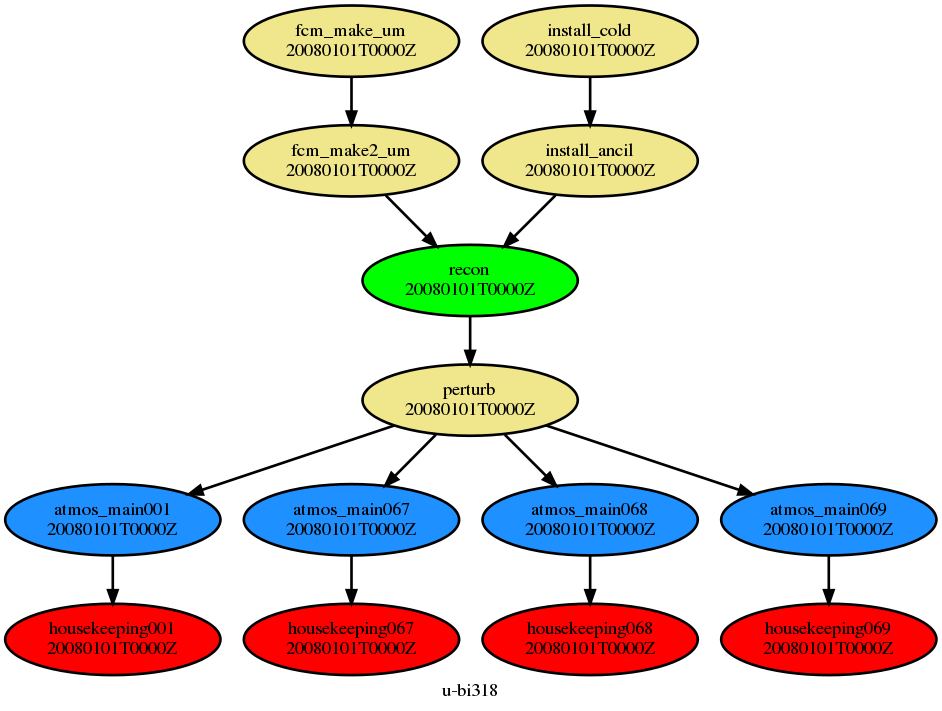
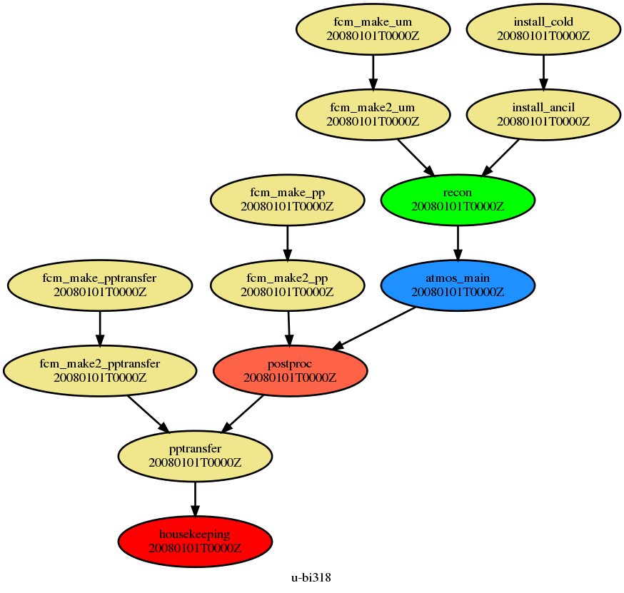
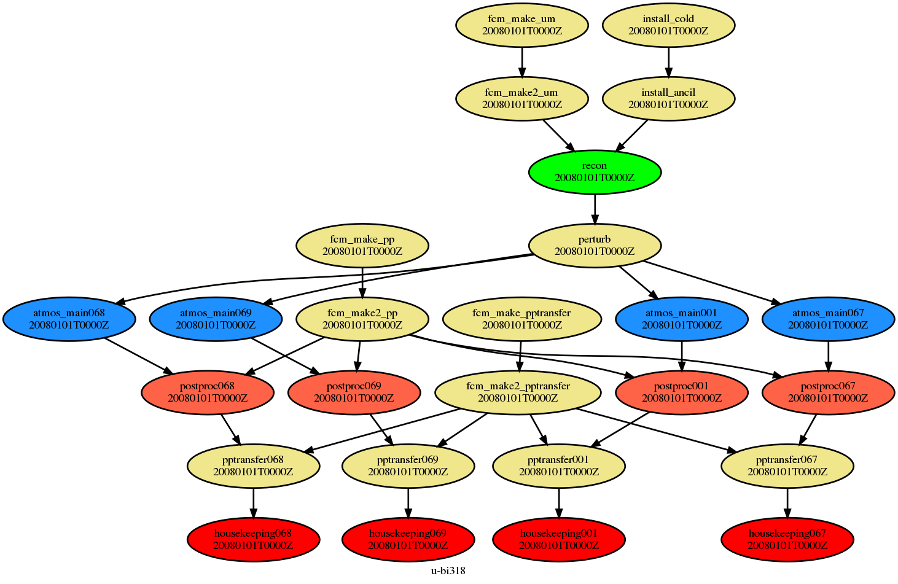

# Converting a Rose Suite for Perturbed Parameter Ensemble (PPE) Experiments

To convert a rose suite for use in a PPE experiment, or for use in any general ensembling system, there are two main changes. The first is the creation of a python script to change the initial parameters for each run, and the inclusion of this script in the cylc task list. The second change is the creation of a parametrised task set within cylc to create the ensemble and keep the data output streams separate. The example I will be referring to in this document is the ACURE PPE suite [u-bi318], within which these changes have been made to convert the atmosphere-only UKESM AMIP suite to an ensembling suite. The associated perturbation script is held within this suite on the repository, so any copy of the suite will have all the code needed to reproduce the changes made so that they can be adapted to a different situation.

## 1. Creation of the perturbation script

The perturbation script is designed to create a set of optional configuration files for the UM which can be used to overwrite the values of certain parameters. One file is created for each ensemble member with its own parameter set, with the parameters themselves read from a dataframe held in a csv file. Throughout the perturbation script there are various points at which the *acure* flag is expected as a part of the variable names. If adapting the script for use with a different experiment then these areas of code will need to be modified.

The perturbation script is held in a new app folder in `roses/u-bi318/app/` called `perturb`. This folder contains a file `rose-app.conf` and a subfolder `bin` folder which contains the perturb script itself and the two input files detailed below. The rose-app.conf file contains a command to run the perturbation script:
```
[command]
default=module load anaconda && perturb_ppe.py --input ${TMPL_LOC} --output ${CONF_LOC} --data ${DF_LOC} --ens ${ENS_LST}
```
This command is run when the perturb task is called by cylc as a task prior to a fork of atmos_main jobs into the ensembled runs, loading the python module and executing the perturb script with a set of four arguments. These arguments are:
* The location of a template configuration file, exported with the name TMPL_LOC by Cylc. The template file is to contain every parameter to be perturbed as a logical set to false with the exception of the regional parameters, as each parameter has an associated logical in the um namelists.
* The location of the optional configuration files folder, typically `app/um/opt` in the Cylc run directory, exported with the name CONF_LOC by Cylc. This directory is where the output files from the script will be placed, for later reading by the atmos_main task in the UM run.
* The ensemble number list, referred to as ENS_LST by Cylc. This takes the form of a space separated list of ensemble members which can be itterated through to create the required specific optional configuration files.
* The location of the PPE dataframe. This dataframe is used by the script to provide the
PPE variables their values and logical switches. A discussion of the required layout of the dataframe file is included later.

In its function, the perturbation script iterates through the elements of the ensemble list. Each ensemble member corresponds to a row in the dataframe. For each ensemble member, the script reads the relevant row, and for variables that have a value other than "x" (used to indicate no perturbation) the replacement value is written to the output configuration file on the line following the corresponding logical switch, ie the section of the template file which reads:
```
l_acure_dry_dep_ait=.false.
l_acure_dry_dep_acc=.false.
l_acure_dry_dep_so2=.false.
l_acure_kappa_oc=.false.
l_acure_sig_w=.false.
```
would be combined with a line in the dataframe reading:
```
|acure_dry_dep_ait|acure_dry_dep_acc|acure_dry_dep_so2|acure_kappa_oc|acure_sig_w|
----------------------------------------------------------------------------------
|          x      |         0.26    |      17.54      |        x     |   0.001   |
```
to give an optional configuration file which contains the lines:
```
l_acure_dry_dep_ait=.false.
l_acure_dry_dep_acc=.true.
acure_dry_dep_acc=0.26
l_acure_dry_dep_so2=.true.
acure_dry_dep_so2=17.54
l_acure_kappa_oc=.false.
l_acure_sig_w=.true.
acure_sig_w=0.001
```

The parameter values written to this output file overwrite the corresponding parameters in the `app/um/rose-app.conf` file from which the UM obtains values input in the GUI - as such if ensembling is enabled the **values from the dataframe completely supercede those from the GUI**.

### Input File Formats ###

There are two input files for the perturbation script - the *template.conf* file and the *ppe_dataframe* file. Both of these files have format rules described below.

#### Template File ####

* The template file must have in it all the logical switches used for the perturbations.
* Typically this will be one per perturbed parameter, however for regional perturbations there is a one-to-many relationship.
* The logical switches must be divided and placed under a heading relating to the namelist in which the logical switch and the associated real variable reside within the code.
* All the logical switches must be set to `.false.`.

The listing below gives an example:
```
[namelist: run_ukca]
l_acure_bl_nuc=.false.
l_acure_ait_width=.false.
l_acure_cloud_ph=.false.
l_acure_carb_ff_ems=.false.
l_acure_carb_bb_ems=.false.
l_acure_carb_res_ems=.false.
l_acure_anth_so2=.false.
l_acure_carb_ff_diam=.false.
l_acure_carb_bb_diam=.false.


[namelist: run_radiation]
l_acure_bparam=.false.
l_acure_two_d_fsd_factor=.false.

[namelist: run_cloud]
l_acure_dbsdtbs_turb_0=.false.
```

#### PPE dataframe file

* The PPE dataframe file should be a csv file
* There should be one row per ensemble member
* If a parameter is not required as part of an ensemble members parameter set, the value in the dataframe should be "x", otherwise a real number is expected.
* There should be the same number of columns in the dataframe as there are logical switches in the template file, plus an additional 22 rows for the four regional parameters.
* Each column should have a header field with the name of the *real* parameter being perturbed. These parameters should match the name of the associated logical, omitting the `l_` characters, i.e. `l_acure_bl_nuc` in the template file would have a corresponding column in the dataframe with the header `acure_bl_nuc`. The columns need not be in the same order as in the template file however.


### Addition of perturb task

The cylc suite.rc file controls the way in which tasks are combined and chained to allow a full UM run to be completed. Generally this is done through constructing a cylc "graph" which, once compiled from the suite.rc file, may take the form
```
    [[dependencies]]
        [[[ R1 ]]]
            graph = fcm_make_um => fcm_make2_um => recon => atmos_main
        [[[ R1 ]]]
            graph = install_cold => install_ancil => recon => atmos_main
        [[[ P1D ]]]
            graph = atmos_main => housekeeping
```
Each of the graph entries is equivalent to a single branch of the cylc graph, shown in the picture below


A few changes are needed to convert this graph structure into one that can be used for ensembling. The first is the addition of the perturb task which sets up the parameter sets for ensembled runs. This is included in the graphs prior to the atmos_main task for all permutations of the first step. This equates to replacing all instances of `recon => atmos_main` with `recon => perturb => atmos_main` in the section of the suite.rc file that sets up the cylc graph and dependencies. To ensure that the perturb script can run when called, the task itself must be defined. This is done in the [runtime] section of the suite.rc file by inserting the following between the `[[recon]]` task and the `[[atmos_main]]` task:
```
    [[perturb]]
        inherit = RUN_MAIN, PERTURB_RESOURCE
        script = "rose task-run --app-key=perturb --verbose"
        [[[environment]]]
            ENS_LST={{ ENS_COMB | join(' ') }}
            TMPL_LOC=${CYLC_SUITE_RUN_DIR}/{{ENS_TMPL}}
            CONF_LOC=${CYLC_SUITE_RUN_DIR}/app/um/opt
            DF_LOC=${CYLC_SUITE_RUN_DIR}/{{ENS_CSV}}
```
The family `PERTURB_RESOURCE` is defined in the relevant site file, in this case the `sites/archer.rc` file:
```
    [[PERTURB_RESOURCE]]
        inherit = HPC_SERIAL
        pre-script = """
                     module load anaconda
                     export PYTHONPATH=$PYTHONPATH:$UMDIR/lib/python2.7
                     """
        [[[directives]]]
            -l walltime=00:05:00
```
A version of this resource should be included in whichever site specific file will be used for the ensembled run that is planned.

### Addition of the ensembling parameters

A set of ensemble specific parameters are included in the suite also, including those referred to in the definition of the perturb task. These parameters are defined in the rose-suite.conf fileand are shown below with example values:
```
ENS_CSV='app/perturb/bin/ppe_dataframe.csv' # Location of the CSV dataframe file
ENS_L='1','4','37-41'  # a list of individual ensemble members to run. Ranges enabled with hyphens
ENS_N=5   # Number of ensemble members, used when autopopulating a range
ENS_RNGE=true  # Logical for whether ensembles are itemised or ranged (f/t respectively)
ENS_STRT=3    # Starting ensemble member for range
ENS_TMPL='app/perturb/bin/template.conf'  # Location of PPE template file
```
To ensure that these parameters can be modified from the rose GUI, the `meta/rose-meta.conf` file must be modified also. By including the following lines these variables are included in a new pane under the "suite conf" heading in the rose GUI,

```ini
[jinja2:suite.rc=ENS_RNGE]
ns          = Ensembles
compulsory  = false
help        =
title       = Run a range of members?
type        = boolean
trigger     = jinja2:suite.rc=ENS_STRT: true;
            = jinja2:suite.rc=ENS_N: true;
            = jinja2:suite.rc=ENS_L: false
sort-key    = 5a

[jinja2:suite.rc=ENS_N]
ns          = Ensembles
compulsory  = false
help        =
title       = Number of consecutive ensemble members
type        = integer
sort-key    = 5b

[jinja2:suite.rc=ENS_STRT]
ns          = Ensembles
compulsory  = false
help        =
title       = First ensemble member in range
type        = integer
sort-key    = 5c

[jinja2:suite.rc=ENS_L]
ns          = Ensembles
compulsory  = false
title       = Individual ensemble members
help        = A range of members may be described using a hyphen.
type        = character
length      = :
sort-key    = 5d

[jinja2:suite.rc=ENS_CSV]
ns          = Ensembles
compulsory  = true
title       = Ensemble csv file
help        = A csv file that defines parameter perturbations.
type        = character
length      = 9999
sort-key    = 4

[jinja2:suite.rc=ENS_TMPL]
ns          = Ensembles
compulsory  = true
title       = Ensemble template namelist file
help        = A configuration file with a list of logical
            = switches for each of the parameters in the PPE.
type        = character
length      = 9999
sort-key    = 3
```

To generate the list of ensemble members required for the ensembled run, the following must be included in the suite.rc file prior to the start of the `[cylc]` environment:

```jinja2



    
        
            
                
            
        
            
        
    

    

```
This block of Jinja2 code takes a range in the form of a list of consecutive or non-consecutive values with the possibility of ranges denoted by two hyphen-separated values, and returns a list object of individual values which can be used as iterators for the perturbation script and for the parametrised tasks.

## 2. Modification of the cylc suite to allow ensembles

### Parametrised Tasks

Ensembing ability is built directly into cylc through parametrised tasks. These were introduced as a replacement for the older alternative method which involved creating a set of individual tasks using a loop written in Jinja2.

Parameterised tasks are set up within the `suite.rc` file, and setting up a set of parametrised tasks begins with creating the itterator. This is done fairly simply by defining a parameter within the `[cylc]` environment:
```ini
[cylc]
    UTC mode = True
    [[events]]
        mail events = shutdown

    
    [[parameters]]
        ens = {{ ENS_COMB | join(', ') }}
    [[parameter templates]]
        ens = %(ens)03d
    
```

Here the parameter `ens` is defined as a comma separated list of the values contained within the `ENS_COMB` variable that was defined and included in the `suite.rc` file in the previous section. A feature of newer versions of Cylc (>7.8.1) is that the format of the `ens` variable can be defined using a parameter template - here the format is set as a three digit integer. Throughout the suite.rc file, the parametrised tasks and sections related to them are enclosed within conditional Jinja2 blocks dependent on the value of the `ENS_LOG` logical.

The next step of setting up the parametrised tasks is creating alternate graphs for ensembling, where ensemble names are appended to the task names. The simplest version of this would be to replace the cylc graph modified previously with the following:
```
[[dependencies]]
    [[[ R1 ]]]
        graph = fcm_make_um => fcm_make2_um => recon => perturb => atmos_main<ens>
    [[[ R1 ]]]
        graph = install_cold => install_ancil => recon => perturb => atmos_main<ens>
    [[[ P1D ]]]
        graph = atmos_main<ens> => housekeeping<ens>
```
where the `<ens>` appended to the end of the task name is replaced with the ensemble number using the format defined earlier. The housekeeping task here is ensembled to prevent any synchronisation problems or delays caused by ensemble members having to wait for their neighbors to all finish before continuing to the next cycle. For a run using ensemble members `1,67-69`, this cylc graph could be shown graphically as below.


The actual cylc graph is not however that simple. Because the data from each ensemble member needs to be held apart from the data of each other ensemble member, any task which exists downstream from the atmos_main task must also be ensembled (just as the housekeeping task is ensembled). This means that post processing tasks have to be modified in the cylc graph also, and so a more realistic non-ensembled graph would look like the one shown below,

making the ensembled version much more messy, and shown below:


Within the suite.rc file, this cylc graph can also be controlled with Jinja2 conditional blocks so that the graph building section becomes as below:

```
{# Define the special tasks, ie those which automatically depend on their #}
{# previous cycle #}

[[special tasks]]
    
    sequential = atmos_main<ens>, postproc<ens>, archive_integrity<ens>, &
                 pptransfer<ens>, supermean<ens>, housekeeping<ens>, &
                 rose_arch_logs<ens>
    
    sequential = atmos_main, postproc, archive_integrity, pptransfer, &
                 supermean, housekeeping, rose_arch_logs
    

[[dependencies]]

    {# Set up build graph #}
    
    
    
    

    {# set dependencies for ensemble tasks #}

    
    
    
    
    

    [[[ R1 ]]]
        graph = {{ BUILD_GRAPH }}

    {# Set up first cycle graph #}
    
    

    {# Same as for build graph #}

    
    
    
    
    

    [[[ R1 ]]]
        graph = {{ INIT_GRAPH }}

    

    {# Set up postproc and pptransfer with or without ensembling #}
    
    [[[ R1 ]]]
        
        graph = fcm_make_pp => fcm_make2_pp => postproc<ens>
        
        graph = fcm_make_pp => fcm_make2_pp => postproc
        
    
    [[[ R1 ]]]
        
        graph = fcm_make_pptransfer => fcm_make2_pptransfer => pptransfer<ens>
        
        graph = fcm_make_pptransfer => fcm_make2_pptransfer => pptransfer
        
    
    

    {# Set up archive integrity checking if defined and enabled for both the #}
    {# testing only case and resubmission #}
    
    
    [[[ {{EXPT_RESUB_ARCHIVE_INTEGRITY}} ]]]
        
        graph = postproc<ens> => archive_integrity<ens> => housekeeping<ens>
        
        graph = postproc => archive_integrity => housekeeping
        
    [[[ R1//^+{{EXPT_RUNLEN}}-{{EXPT_RESUB}} ]]]
        
        graph = postproc<ens> => archive_integrity<ens> => housekeeping<ens>
        
        graph = postproc => archive_integrity => housekeeping
        
    
    

    {# Set up cycling graph, adding each post processing task in turn if enabled#}
    

    

    
    
    
    
    

    

    
    
    
    
    

    


    [[[ {{EXPT_RESUB}} ]]]
        
        graph = atmos_main<ens> => {{ RESUB_GRAPH }}
        
        graph = atmos_main => {{ RESUB_GRAPH }}
        

    
    [[[ R1//^+{{EXPT_RUNLEN}}-{{EXPT_RESUB}} ]]]
        
        graph = atmos_main<ens> => rose_arch_wallclock => housekeeping
        
        graph = atmos_main => rose_arch_wallclock => housekeeping
        
    

    {# Include tests graph if required #}
    
    %include suite-tests-graph.rc
    

    

```
Note that for readability some linebreaks have been added with ampersands "`&`" to denote them. These are not present in the suite.rc file.

With the ensembled tasks included in the cylc graph, they now need to be created and defined within the `[runtime]` section. An example of how a task is defined is given below, for the atmos_main task:
```
[[atmos_main]]
    inherit = RUN_MAIN, ATMOS_RESOURCE, ATMOS
    post-script = save_wallclock.sh {{EXPT_RESUB}}
    [[[environment]]]  
        ENS_MEMBER = 0
```

In addition to this a new version for ensembling must be defined such as below:
```
[[atmos_main<ens>]]
    inherit = PPE_MEMB<ens>, ATMOS_RESOURCE, ATMOS
    post-script = save_wallclock.sh {{EXPT_RESUB}}
    [[[environment]]]
        ROSE_APP_OPT_CONF_KEYS = ens_${CYLC_TASK_PARAM_ens} {{CONFIG_OPT}}
                                 {{BITCOMP_NRUN_OPT}}
        ENS_MEMBER=${CYLC_TASK_PARAM_ens}
```
In the above, the `ENS_MEMBER` variable has its value changed to `${CYLC_TASK_PARAM_ens}`, which is an in-built way of calling the value of a cylc parameter, in this case the parameter `ens` that was defined before. A line has also been added referring to the variable `ROSE_APP_OPT_CONF_KEYS`. This is one of the main changes to the tasks, and the one which allows the perturbed atmosphere tasks to be run. This variable is defined earlier as an environment variable in the `[[UM]]` family and passed through to the atmos_main task. In ensembling mode this variable is redefined to include the `rose-app-ens_<ens number>.conf` file as an optional configuration file which is the output of the perturb task. The dependencies are illustrated below.

```
____________________________________________________________________________
|                                                                          |
|    [[UM]]                                                                |
|        [[[environment]]]                                                 |
|            ROSE_APP_OPT_CONF_KEYS = {{CONFIG_OPT}} {{BITCOMP_NRUN_OPT}}  |
|__________________________________________________________________________|
   |
   |    __________________________
   |    |                        |
   |--->|    [[ATMOS]]           |
        |        inherit = UM    |
        |________________________|
            |
            |    _______________________________________________________
            |    |                                                     |
            |--->|    [[atmos_main]]                                   |
            |    |        inherit = RUN_MAIN, ATMOS_RESOURCE, ATMOS    |
            |    |_____________________________________________________|
            |    _____________________________________________________________________
            |    |                                                                   |
            |--->|    [[atmos_main<ens>]]                                            |
                 |        inherit = PPE_MEMB<ens>, ATMOS_RESOURCE, ATMOS             |
                 |        [[[environment]]]                                          |
                 |            ROSE_APP_OPT_CONF_KEYS = ens_${CYLC_TASK_PARAM_ens}    |
                 |                                    {{CONFIG_OPT}}                 |
                 |                                    {{BITCOMP_NRUN_OPT}}           |
                 |___________________________________________________________________|
```
A further change to allow ensembling is that the family `RUN_MAIN` is replaced with a new family `PPE_MEMB<ens>`. This is done to control the output directory of the atmos_main<ens\> task through the `DATAM` variable which is defined in these families as shown below:

```
[[RUN_MAIN]]
    [[[environment]]]
        DATAM = $ROSE_DATA/{{DATAM}}


[[PPE_MEMB<ens>]]
    [[[environment]]]
        DATAM=${ROSE_DATA}/{{DATAM}}/ens_${CYLC_TASK_PARAM_ens}


```
As earlier, the ensembling code is enclosed in a conditional block which ensures that if ensembling is not enabled, the suite will still run as normal with no extra settings required and will still be able to read in the PPE variables as set in the GUI. This is done for all of the ensembling parametrised tasks. For some of the parametrised tasks, the only main changes are the replacement of `RUN_MAIN` with `PPE_MEMB<ens>` and the addition of the `<ens>` at the end of the task name. For others however the changes are slightly more substantial; one more substantial change made to both the ensembling and non-ensembling versions of the post processing group of tasks is the definition within the task of the variable `ARCHIVE_SET` which sets the folder name for the archive group. The line `ARCHIVE_SET=$CYLC_SUITE_NAME` appears in the environment variables for the `[[root]]` block (on which each task and family is built) in the suite.rc file for the unmodified AMIP suite. In the ensembling suite this is moved to be within the environment variables for the tasks which use it such as `postproc` and `pptransfer`. This allows ensemble-specific values to be assigned to this variable in parametrised tasks. In some tasks there is the addition of a block labelled `[[[parameter environment variables]]]`. This block, a feature implemented in Cylc 7.8.1, allows the format of variable values related to parametrised task iterators (such as `<ens>`) to be defined in the same way as the `[[parameter templates]]` section earlier. A further change to some of the tasks is to add a variable `ROSE_TASK_APP` which defines the app name, as without this variable the app name defaults to the name of the task. This could cause problems when there is no rose app called *atmos_main065* for example. The table below details the tasks and changes made (not including the addition of the `<ens>` parametrisation indicator in the task name or the use of the `PPE_MEMB<ens>` family in place of `RUN_MAIN`):

|Task|Changes|
|---|---|
|recon | New section - `[[[environment]]]`|
|   | New line in `[[[environment]]]`:<br>`ENS_MEMBER=0`|
|perturb|New task - detailed earlier|
|atmos_main| New line in `[[[environment]]]`:<br>`ENS_MEMBER=0`|
|atmos_main<ens\>| New line in `[[[environment]]]`:<br>`ROSE_APP_OPT_CONF_KEYS = ens_${CYLC_TASK_PARAM_ens} {{CONFIG_OPT}} {{BITCOMP_NRUN_OPT}}`|
|   | New line in `[[[environment]]]`:<br>`ENS_MEMBER=${CYLC_TASK_PARAM_ens}`|
|postproc| New line in `[[[environment]]]`:<br>`UMTASKNAME=atmos_main`
|   | New line in `[[[environment]]]`:<br>`ARCHIVE_SET=$CYLC_SUITE_NAME`
|postproc<ens\>| New line in `[[[environment]]]`:<br> `ROSE_TASK_APP = postproc` |
|   | New section - `[[[parameter environment templates]]]` |
|   | New line in `[[[parameter environment templates]]]`:<br>`UMTASKNAME=atmos_main%(ens)03d` |
|   | New line in `[[[parameter environment templates]]]`:<br>`ARCHIVE_SET=${CYLC_SUITE_NAME}_ens%(ens)03d` |
|pptransfer| New line in `[[[environment]]]`:<br>`UMTASKNAME=atmos_main`
|   | New line in `[[[environment]]]`:<br>`ARCHIVE_SET=$CYLC_SUITE_NAME`
|pptransfer<ens\>| New section - `[[[parameter environment templates]]]` |
|   | New line in `[[[parameter environment templates]]]`:<br>`UMTASKNAME=atmos_main%(ens)03d` |
|   | New line in `[[[parameter environment templates]]]`:<br>`ARCHIVE_SET=${CYLC_SUITE_NAME}_ens%(ens)03d` |
|supermean| New line in `[[[environment]]]`:<br>`ARCHIVE_SET=$CYLC_SUITE_NAME`
|supermean<ens\>| New line in `[[[environment]]]`:<br> `ROSE_TASK_APP = supermean`
|   | New section - `[[[parameter environment templates]]]` |
|   | New line in `[[[parameter environment templates]]]`:<br>`ARCHIVE_SET=${CYLC_SUITE_NAME}_ens%(ens)03d` |
|archive_integrity| New line in `[[[environment]]]`:<br>`UMTASKNAME=atmos_main`
|   | New line in `[[[environment]]]`:<br>`ARCHIVE_SET=$CYLC_SUITE_NAME`
|archive_integrity<ens\>| New section - `[[[parameter environment templates]]]` |
|   | New line in `[[[parameter environment templates]]]`:<br>`UMTASKNAME=atmos_main%(ens)03d` |
|   | New line in `[[[parameter environment templates]]]`:<br>`ARCHIVE_SET=${CYLC_SUITE_NAME}_ens%(ens)03d` |
|pptransfer| New line in `[[[environment]]]`:<br>`UMTASKNAME=atmos_main`
|   | New line in `[[[environment]]]`:<br>`ARCHIVE_SET=$CYLC_SUITE_NAME`
|pptransfer<ens\>| New section - `[[[parameter environment templates]]]` |
|   | New line in `[[[parameter environment templates]]]`:<br>`UMTASKNAME=atmos_main%(ens)03d` |
|   | New line in `[[[parameter environment templates]]]`:<br>`ARCHIVE_SET=${CYLC_SUITE_NAME}_ens%(ens)03d` |
|rose_arch_logs<ens\>|Created|
|rose_arch_wallclock<ens\>|Created|
|housekeeping<ens\>|New section - `[[[environment]]]`|
|   | New line in `[[[environment]]]`:<br>`ROSE_TASK_APP = housekeeping`|

Additions are made above to some of the non-ensembling versions of the tasks for consistency, specifically the addition of the variable `ENS_MEMBER` in the recon and atmos_main tasks, and the variable `UMTASKNAME`. These are reflected in the rose-app.conf files for the various apps and will be discussed in the next subsection.

### Modification of further files in the rose suite

To make the parametrised tasks work correctly, some in built Cylc variables have been moved, and other new variables have been added. The changes made to the files `suite.rc`,`meta/rose-meta.conf`, `site/archer.rc` and `rose-suite.conf` have already been detailed above. In addition to these however, minor changes need to be made to the following files:

**app/um/rose-app.conf** - Within the `[env]` block, the line `ENS_MEMBER=0` must be replaced with `ENS_MEMBER=${ENS_MEMBER}`. This will cause it to use the value for this variable imported from the Cylc environment defined in the `suite.rc` file

**app/postproc/rose-app.conf** - The last line of the file, which reads `umtask_name=atmos_main` should be replaced with the line `umtask_name=${UMTASKNAME}`. Again, this will cause it to use the value for this variable imported from the Cylc environment defined in the `suite.rc` file.
